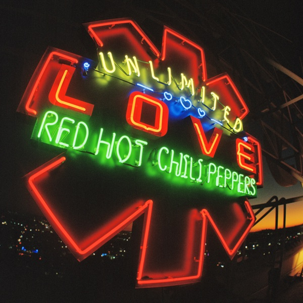

# Red Hot Chili Peppers - Unlimited Love

[ **Listen on Spotify** ](https://open.spotify.com/playlist/2zPCPhwAUOLqyrAGrBHRZm?si=277c3b0c55174afd)

I’ve been kinda surprised to find out that Red Hot Chili Peppers pushed a new release. And, honestly, I’ve been sure that it’s gonna be that kind of RHCP that I do not like, but anyway, I’ve decided to listen. Not to be a windbag, you know.
So biased and without any positive expectations, I turned it on. 

It is starting cool. I was listening with a good feeling about it. Because the album somehow sounds like going back to the younger RHCP. Not that young-n-high kind, of course, but to the good-young anyway.

There is not much that I can say about it. The mixing is great, arrangements - too. Sometimes I've been catching myself with thoughts like: "why the hell the man is singing that stuff?". For example, the line "Love Me, Love Me, Wake Up And Hug Me." But here, I'm not talking about lyrics, so I'll pretend that it didn't touch me. 

For me, the main problem with this album is its length. It's damn too long. And I was just tired of it and wished that it was gonna end soon after the **Bastards of Light**. 

This album is just good, but I'd say **56/100**. I think this album deserves to be heard by fans of ±2000 Red Hot Chili Peppers.

_Also, I can't escape from hearing "Everybody's going to the party, Have a real good time" when the solo in the It's Only Natural begins (4.30)_

 **Best songs**:
- [Here Even After](https://open.spotify.com/track/0zckHMfaB6vT5o23ZVBLHJ?si=ef39e50399664999)
- [Aquatic Mouth Dance](https://open.spotify.com/track/38Ow67MO6ScViFHK1j2qgN?si=5ac3973bbbd34ad2)
- [Not the One](https://open.spotify.com/track/2Uze78n7BgWsV91bUMtflX?si=d4a320044683408a)
- [Poster Child](https://open.spotify.com/track/6LwwlI0IvFTN6DRUDdkkT8?si=ac3defe69be844f7)
- [It's Only Natural](https://open.spotify.com/track/2p0W20VwOJpXt323xv8OAJ?si=5139520bfa984207)
- [Whatchu Thinkin'](https://open.spotify.com/track/37o0LxdGxiF3chjxjwJwBD?si=71e9d5094eb24671)
- [Bastards of Light](https://open.spotify.com/track/5oRG4KJFamOaLASrNaL5Zo?si=dd021a27480145a6)
- [The Heavy Wing](https://open.spotify.com/track/4VnqpGitjmsIRNCnonQMzi?si=fc88bb28e43241cf)

