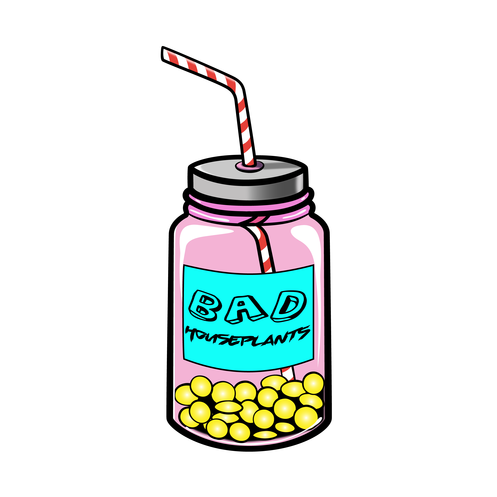

# Bad Houseplants

## About me

**Oi!** I am allanger. This is a place where I'm talking about music. Here you will find articles about music creatation, releases review and some other stuff.

This site is built with **Hexo**, but I hope that one day I will create a normal web application for that.

If you have any questions and anything to say, feel free to write me an [email](mailto:allanger@zohomail.com)

## Ratings

I'm listening to releases and writing little reviews here. At the end of each article, I evaluate the release based on these criteria: 
- **Specialty**
How much the release differs from other ones? Where zero means nothing special about this one, but ten means it's unique and original.
- **Boringness**
Is the release (not) boring? I'm rating on a scale of zero to ten, where 0 is for completely boring one, and 10 is for absolutely gripping.
- **Quality of mixing**
It may not be fair to talk about quality. It's gotta be more about how much I like the mixing, zero to ten as usual.
- **Quality of arrangement**
Does the arrangement sound interesting to me? For example, cool catchy licks,  complicated riffs, sick drum tracks, breaks, drops, rhythmical moves, and stuff like that will be here.
- **Catchiness**
This seems pretty important to me that release must contain catchy songs that must get stuck in the head and not stop repeating for as long as possible. 
- **Sound Design**
This is something on the border between mixing and arrangement. This is about cool sounds that are being used in the release.

So the best result possible to achieve is 60, and I will just calculate the percentage of it to make it look better. For example, 45/60 is going to be 75/100.

## Lyrics

The other category of rating is the lyrics rating. Not all releases contain lyrics, and even if they do, I just can't understand them unless I know the language. So it's not fair to put this evaluation in the same rating. So I will rate lyrics, but it will be another rating.
